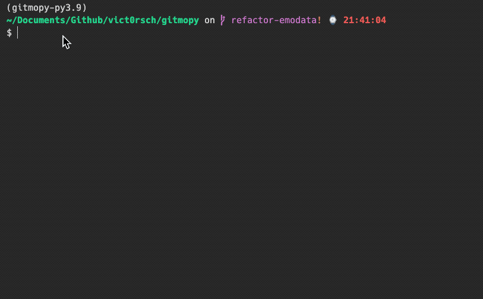
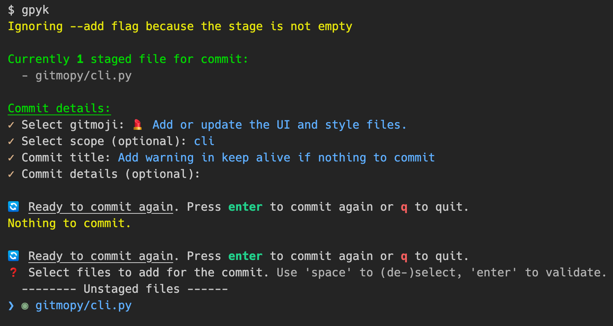

# gitmopy

An interactive Python implementation of the Gitmoji standard: https://gitmoji.dev/

```
pip install gitmopy
```



## Suggested shortcuts

```bash
alias gpy="gitmopy"
alias gpyc="gitmopy commit"
alias gpya="gitmopy commit --add"
alias gpyk="gitmopy commit --add --keep-alive"
```



## User guide

```text
$ gitmopy info

gitmopy info:
  version : 0.1.0
  app path: /Users/victor/.gitmopy
  history : /Users/victor/.gitmopy/history.json
  config  : /Users/victor/.gitmopy/config.yaml

Current configuration:
  skip_scope      : False
  skip_message    : False
  capitalize_title: True
  enable_history  : True
```

Update configuration with

```text
$ gitmopy config
$ gitmopy config
❓ Configure gitmopy locally. Use 'space' to (de-)select, 'enter' to validate.
❯ ○ Skip commit scope
  ○ Skip commit message
  ◉ Capitalize commit title
  ◉ Remember commit history for auto-complete and emoji sorting

Config will be saved in /Users/victor/.gitmopy/config.yaml.
```

Get help with

```text
$ gitmopy --help

 Usage: gitmopy [OPTIONS] COMMAND [ARGS]...

╭─ Options ───────────────────────────────────────────────────────────────────────────╮
│ --install-completion          Install completion for the current shell.             │
│ --show-completion             Show completion for the current shell, to copy it or  │
│                               customize the installation.                           │
│ --help                        Show this message and exit.                           │
╰─────────────────────────────────────────────────────────────────────────────────────╯
╭─ Commands ──────────────────────────────────────────────────────────────────────────╮
│ commit  Commit staged files. Use --add to interactively select files to stage if    │
│         none is already staged                                                      │
│ config  Configure gitmopy                                                           │
│ info    Print gitmopy info                                                          │
╰─────────────────────────────────────────────────────────────────────────────────────╯

$ gitmopy commit --help

 Usage: gitmopy commit [OPTIONS]

 Commit staged files. Use --add to interactively select files to stage if none is
 already staged

╭─ Options ───────────────────────────────────────────────────────────────────────────╮
│ --repo                 TEXT  Path to the git repository [default: .]                │
│ --add     --no-add           Whether or not to interactively select files to stage  │
│                              if none is already staged                              │
│                              [default: no-add]                                      │
│ --push    --no-push          Whether to `git push` after commit. Disabled by        │
│                              default.                                               │
│                              [default: no-push]                                     │
│ --dry     --no-dry           Whether or not to actually commit. [default: no-dry]   │
│ --help                       Show this message and exit.                            │
╰─────────────────────────────────────────────────────────────────────────────────────╯
```

## To Do

* Tests
  * https://typer.tiangolo.com/tutorial/testing/
  * 👋 **Help wanted**
* Docs
  * Not critical

# Resources

`gitmopy` is inspired by

It is built thanks to:

* [`typer`](https://github.com/tiangolo/typer)
* [`InquirePy`](https://github.com/kazhala/InquirerPy)
* [`GitPython](https://github.com/gitpython-developers/GitPython)
